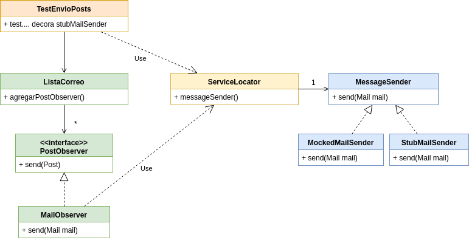

# Ejercicio Patrones - Lista de correo

[](https://travis-ci.com/uqbar-project/eg-lista-correo-xtend) [](https://coveralls.io/github/uqbar-project/eg-lista-correo-xtend?branch=service-locator&service=github)

Ver [README](https://github.com/uqbar-project/eg-lista-correo-xtend/blob/master/README.md)


## Objetivo

En este branch implementamos el patrón arquitectural [ServiceLocator](https://en.wikipedia.org/wiki/Service_locator_pattern) [-1-](http://www.oracle.com/technetwork/java/servicelocator-137181.html), que consiste en implementar una clase Singleton que disponibiliza referencias globales de manera de poder asignarlas o accederlas desde un único punto de acceso.

Así, el test que valida el envío de mails asigna un messageSender por defecto:

```xtend
class TestEnvioPosts {

	@Before
	def void init() {
		...
		stubMailSender = new StubMailSender
		...
		/** ************************************************/
		/** Configuramos ServiceLocator para tener el stub */	
		ServiceLocator.instance.messageSender = stubMailSender
		/** ************************************************/

```

Cuando necesitamos reemplazar el _stub_ del message sender por un _mock_, lo hacemos desde un método específico:

```xtend
	@Test
	def void testEnvioPostAListaAlumnosLlegaATodosLosOtrosSuscriptos() {
		ServiceLocator.instance.messageSender = mockedMailSender
		listaAlumnos.eliminarObservers
		listaAlumnos.agregarPostObserver(new MailObserver)

		// un alumno envía un mensaje a la lista
		listaAlumnos.recibirPost(mensajeDodainAlumnos)

		//verificacion
		//test de comportamiento, verifico que se enviaron 2 mails 
		// a fede y a deby, no así a dodi que fue el que envió el post
		verify(mockedMailSender, times(2)).send(any(typeof(Mail)))
	}
```

El MailObserver le pide el message sender al Service Locator:

```xtend
	override send(Post post) {
		val lista = post.destino
		lista.getMailsDestino(post).forEach [ mailDestino |
			val mail = new Mail => [
				from = post.emisor.mail
				titulo = "[" + lista.encabezado + "] nuevo post"
				message = post.mensaje
				to = mailDestino
			]
			// messageSender se obtiene del singleton ServiceLocator
			ServiceLocator.instance.messageSender.send(mail)
		]
	}
```

## Gráfico general

A continuación dejamos un gráfico general de la solución:




## Consecuencias

[Algunos pueden considerar la técnica de Service Locator un anti-pattern](http://blog.ploeh.dk/2010/02/03/ServiceLocatorisanAnti-Pattern/), porque simplemente expone una "bolsa de gatos" de variables globales que no están relacionadas, lo que le da una baja cohesión. Además, el uso de variables que pueden no estar inicializadas producen errores de difícil trazabilidad.
