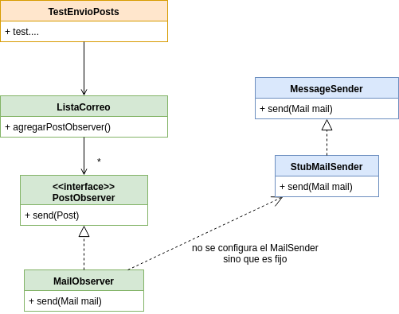

# Ejercicio Patrones - Lista de correo

[](https://travis-ci.org/uqbar-project/eg-lista-correo-xtend) [](https://coveralls.io/github/uqbar-project/eg-lista-correo-xtend?branch=singleton&service=github)

**Nota:** el build de este branch falla adrede, porque no se puede simular el envío de mails cuando el componente que envía mails es un Singleton.

Ver [README](https://github.com/uqbar-project/eg-lista-correo-xtend/blob/master/README.md)

## Objetivo

En este branch implementamos el StubMailSender como un Singleton, lo que nos asegura un único punto de acceso global en toda la aplicación (que exista un único objeto en el ambiente es simplemente una consecuencia).

Así, el test que valida el envío de mails no le pasa el messageSender al MailObserver, solamente referencia al singleton StubMailSender global:

```xtend
class TestEnvioPosts {
	StubMailSender stubMailSender = StubMailSender.instance

	listaAlumnos => [
		agregarMiembro(deby)
		agregarPostObserver(new MailObserver)
```

Cuando necesitamos reemplazar el _stub_ del message sender por un _mock_, no podemos hacerlo porque el MailObserver, ya que el constructor dejó de publicar el parámetro para ingresar el mailSender.

```xtend
	@Test
	def void testEnvioPostAListaAlumnosLlegaATodosLosOtrosSuscriptos() {
		//creacion de mock
		val mockedMailSender = mock(typeof(MessageSender))
		//no le puedo pasar el mockedMailSender!!
		//listaAlumnos.agregarPostObserver(new MailObserver(mockedMailSender))
```

Y no lo pide más porque el MailObserver utiliza directamente la referencia global al StubMailSender...

```xtend
	override send(Post post) {
		val lista = post.destino
		lista.getMailsDestino(post).forEach [ mailDestino |
			val mail = new Mail => [
				from = post.emisor.mail
				titulo = "[" + lista.encabezado + "] nuevo post"
				message = post.mensaje
				to = mailDestino
			]
			// messageSender se reemplaza por la instancia concreta singleton
			StubMailSender.instance.send(mail)
		]
	}
```


## Gráfico general

A continuación dejamos un gráfico general de la solución:




## Consecuencias

El mail sender que utiliza el MailObserver está _hardcodeado_, es decir, fijo y no es dinámico, lo que provoca que fallen los tests que quieran utilizar otro componente diferente (el mock del MailSender, por ejemplo).
